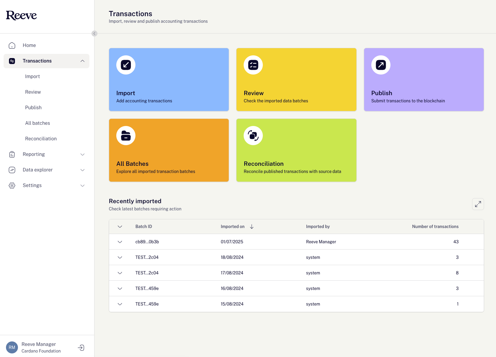

# Reeve Indexer UI

  
  
  
  
  
  
  
  

## 🚀 Project Description

This repository houses the **public frontend application** for **Reeve**.

The app is built with:

- **ReactJS** + **TypeScript**
- **ViteJS** for blazing-fast builds and development
- **MUI (Material UI)** for modern and accessible components
- **TanStack Query** (formerly React Query) for data fetching and caching
- **Formik** for robust form management
- **i18n** for internationalization support

Developed with TypeScript, React.js, and MUI (Material UI), it showcases a user-friendly interface that allows users to access Transactions, Reports and Dashbaords published via Authenticated Reeve platform application.

👉 Check the [Reeve Platform repository](https://github.com/cardano-foundation/cf-reeve-platform) to understand how the microservices work together

## ⚙️ Setup

### Prerequisites

- **Node.js** v20.10.0+
  > _(A `.nvmrc` file is included — use `nvm use` to set the correct version.)_
- **npm** v10.2.x

---

## Install and run

Install the app with npm:

**Step 1**: Install packages
Open terminal and run commad: `npm install`

**Step 2**:

1. Create a `.env` file at the root of the project.
2. Use `.env.example` as a template.
3. Ask a team member for the required environment variables & corresponding values for the API.

**Step 3** Update env variables:

- Update port for application.

  > Example: `PORT=3000`

- Update API URL for Reeve Platform API service.
  > Example: `VITE_API_URL=http://localhost:9000`
- If you prefer Backend service from dev environment then replace it with dev env API url.
  > Example: `VITE_API_URL=https://api.indexer.dev.reeve.****`

## More documentation

- [Development](documentation/DEVELOPMENT.md) - description of our conventions and explanation of some concepts
- [Backend Documentation](https://docs.reeve.technology/) - The main components of Reeve are within the [Reeve Platform Repository](https://github.com/cardano-foundation/cf-reeve-platform) . This repository contains all core modules which are needed to run Reeve. [The Reeve Application](https://github.com/cardano-foundation/cf-reeve-application)  repository contains the actual implementation of the Reeve Platform, including configurations and examples of how to run the Reeve application.

**Built with ❤️ for the Cardano ecosystem**