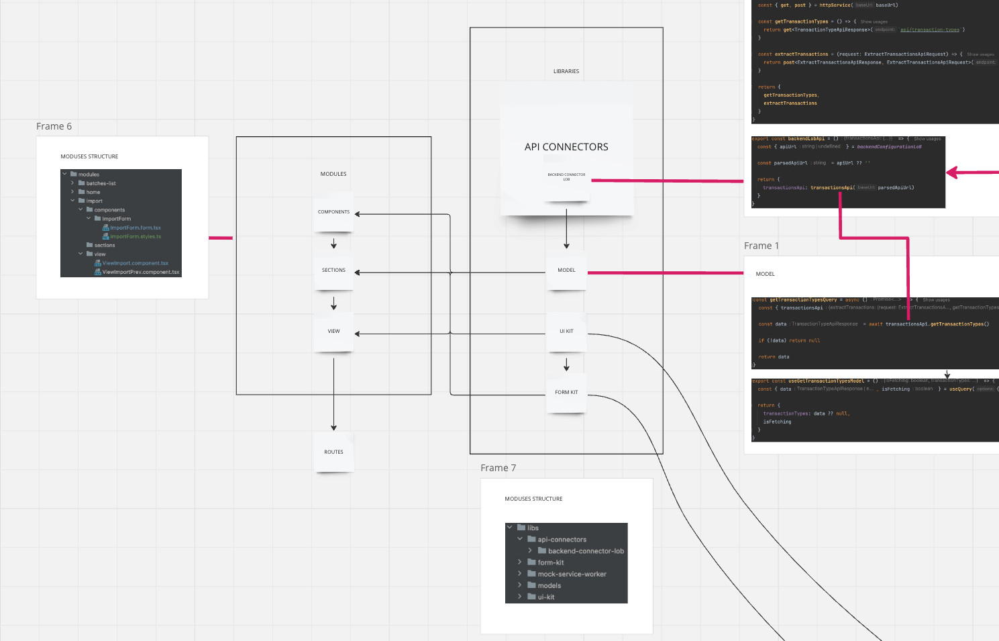

# Development

## Table of Contents

- [Conventions and Patterns](#conventions-and-patterns)
- [Structure](#structure)
- [Contributing](#contributing)

## Conventions and Patterns

- Please use specific prefixes for booleans values, e.g. `isPrimary`, `hasIcon`, `isActive`, `shouldReload`, `hasError`, `isLoading`. There are some exceptions:
  - native html elements' attributes e.g. `disabled` in components which eventually render a native html element
- Name functions in a way that they indicate what they do (use verb), and what they use to do it e.g.

  ```ts
  const addUser = userData => {...}
  ```

  ```ts
  const renderItems = items => {...}
  ```

  ```ts
  const getColor =  color => {...}
  ```

- If the name is composed of multiple words, it is good to place the main phrase at the beginning,
  even if grammatically it sounds awkward e.g. `LayoutOnboardingIndividual`. Although you might be tempted to call it `IndividualOnboardingLayout`,
  it is best to call it `LayoutOnboardingIndividual`, if the fact that the layout is the most important factor in the particular case
- Use `SNAKE_CASE_WITH_ALL_CAPS` for names of the consts storing strings which are frequently reused e.g. `const TRANSACTIONS = 'transactions'`. Please note that the name should be composed of the same words as the stored string.
- General advice: do not try to write as short names as possible, longer and more meaningful name is usually better.
- If there is a lot of mocked data and it doesn't fit inside for example test file, it should be moved to `ComponentName.mocks.ts`. Mocked data shouldn't be mixed with consts used in the application.
- If you add a 'TODO comment', try to include JIRA ticket number, for example: `// TODO: <LOB-123> todo content`.
- Do not use `React.FC` for typing Function Components. Add types this way:

  ```tsx
  interface ComponentProps {
    prop: string
  }

  export  const Component = ({ props }: ComponentProps) => {...}
  ```

- Use PascalCase for enum names and CAPITALCASE for enum values:

  ```tsx
  enum BadgeColours {
    RED = 'RED',
    GREEN = 'GREEN',
    YELLOW = 'YELLOW'
  }
  ```

## Structure

The high level architecture is presented on this [diagram](https://miro.com/app/board/uXjVKETjtZc=/). You can find password for this miro board in 1Pass: cardano-foundation-client / LoB Architecture. Alternatively, you can ask your team member.

Here you can see part of the architecture diagram:


````
Here is an example of the single component directory structure together with file extensions:

```tsx
ComponentName // directory name
ComponentName.component.tsx // composition and structure of a component
ComponentName.styles.ts // styles using styled-components
ComponentName.spec.tsx // tests for component

// If you need to extract form logic to separate component.
// If your form is small you can use it inside *.component.tsx
ComponentName.form.tsx
ComponentName.form.spec.tsx

// If you want to reuse set of fields
ComponentName.fieldset.tsx
ComponentName.fieldset.spec.tsx

ComponentName.types.ts // types apart from props for the specific component (which is in ComponentName.component.tsx)
ComponentName.mocks.ts // if you feel your mocks are too big you can extract them here
ComponentName.service.ts // logic for you component. Can include hooks if there are not too many. If this file will be growing bigger due to amount of hooks you can extract those to hooks folder
ComponentName.service.spec.ts

hooks
  useHookName.(ts|tsx)
  useHookName.spec.(ts|tsx)
````

In the case of `components` directory, where we keep reusable components, we tend to have flat structure. Though if there are multiple similar components, we group them, e.g. in directory `Cards` (inside: `Card`, `CardWithImage`, `CardWithIcon`).

### Structure - forms

For fields and inputs we have convetions to use prefixes of `Field*` or `Input*`.

Files with `Field*` prefix - field with predefined label, name, component type ready to be used in a form (ex. FieldPassword, FieldEmail, FieldAddressStreet)

Files with `Input*` prefix - component that can be used by field as a component type (ex. InputNumber, InputCheckbox etc). Usually it's restyled MUI component (this is our go-to approach)

### Where should I put my files?

- if my code is used only in component scope and it's super small (ex. one styled-comp, one util, one small hook) --> keep it ok to keep it in the single file with component declaration (`ComponentName.component.tsx`)

## Contributing

While naming a branch please start with the task type indicator (feature, fix or hotfix) followed by `/` , ticket number and task description e.g. `feature/LOB-123-add-navbar`, `fix/LOB-456-fix-button`.

We are using [conventional commits](https://www.conventionalcommits.org/en/v1.0.0/)

Available types:

| type       | description                                                                                            |
| ---------- | ------------------------------------------------------------------------------------------------------ |
| `feat`     | new feature (bumps minor version - x.1.0)                                                              |
| `fix`      | bug fix (bumps fix version - x.x.1)                                                                    |
| `docs`     | documentation changes                                                                                  |
| `style`    | changes that do not affect the meaning of the code (white-space, formatting, missing semi-colons, etc) |
| `refactor` | self explained - not a feat/fix, just plain refactor                                                   |
| `test`     | commit with tests only                                                                                 |
| `chore`    | other changes - build process, tools, docs generation                                                  |

Most frequently used are: feat, fix and test, e.g. `feat: add navbar`, `fix: apply qa fixes`, `test: add more tests for navbar`. If you update README, the commit message would be `docs: update readme`. If you'd like to learn more, see the [Commitizen documentation](https://github.com/commitizen/cz-cli)
